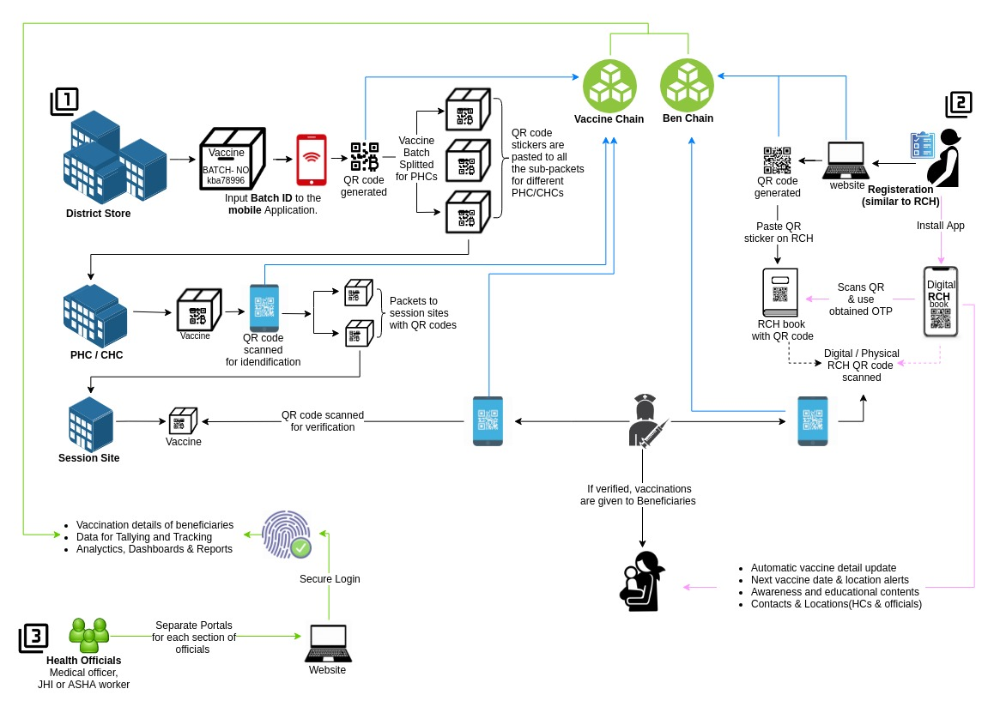

# ImmunoChain

The ImmunoChain project is all about managing and tracing the vaccine stocks, logistics and distribution across a region. The Immunochain project is inclusive of a web application and a mobile application.

Immunochain-Core is a project which deals with all the APIs required for the project  Immunochain, i.e. the web as well as the mobile application of the project. It is the core back end of immunochain.
[ImmunoChain-core](immunochain-core)

The web application of immunochain project provides a dashboard with vaccination analytics, beneficiary management, and user management. The beneficiary management includes beneficiary registration, QR code generation, view /edit provision of beneficiary details, add/edit provision of the vaccines administered for the child etc. The user management  defines the users who are allowed to use the various functionalities of Immunochain application.
[ImmunoChain-dashboard](immuno_dashboard)

The mobile application is Immunochain RCH Book application, which  is a digital form of RCH Book which provides mother and child beneficiary details. The beneficiary details which are collected during the registration includes family details, pregnancy related details and service provider details. The RCH user can view these beneficiary details. The RCH Book provides vaccination details of the child which includes details about vaccines taken and the vaccines missed.
[ImmunoChain-mobileapp](immunochain-vaccinationclient)

